# Godot-GameGUI
A Godot 4.x plug-in that implements a rich and robust dynamic layout and sizing system for building user interfaces.

About      | Current Release
-----------|-----------------------
Version    | 1.4.1
Date       | October 14, 2023
Change Log | [Change Log](ChangeLog.md)
Platform   | Godot 4.x (tested on 4.2-dev3)
License    | [MIT License](LICENSE)
Author     | Brom Bresenham

*DemoProject - included in this repo*

*Axor the Mighty - see how this was built in the [Week 6 Devlog](https://youtu.be/Bq8M416Lcz4?si=9NVwZfn5KlI3fstB)*

# About
GameGUI is a set of Godot Control nodes that provide alternative layout capabilities to Godot's built-in Container classes. With Godot's built-in containers it is easy to make fixed-layout user interfaces that scale with the screen resolution *or* dynamic (responsive) layouts with fixed-size controls (such as labels), but it can be difficult to make dynamic layouts with scaling controls and text, and that's where GameGUI fits in.

## Key Features
- GameGUI layout nodes can be intermingled with standard Control nodes.
- Layout of GameGUI subtrees is performed through recursive subdivision of available space via nested nodes.
- Each GameGUI node can be configured to use various sizing modes that determine how it uses the space available to it: Expand-to-Fill, Aspect-Fit, etc.
- Godot Control Container Sizing alignments (`Shrink Begin`, etc.) are respected.
- GGComponent is the base node that implements the core functionality of the GameGUI system.
- GGHBox and GGVbox are the layout workhorses. They are GameGUI variations of HBoxContainer and VBoxContainer that distribute available space to their children in an intuitive way.
- Minimum and maximum node constraints can be established with a GGLimitedSizeComponent node.
- Non-GameGUI Control nodes can be children of GameGUI nodes. They are stretched horizontally and vertically to fit the space their parent provides.
- Any control node can be adapted to have the same scaling options as a GGComponent node by extending them with "adapter code" that adds certain properties and methods, making the control node a "duck-typed" fit. See GGTextureRect for a general example of adapter code that can be copy-pasted with minimal changes, or see GGLabel for code that auto-scales text size as well.
- GGLabel, GGRichTextLabel, and GGButton are adapted versions of their namesakes that can scale their text size with the layout size.
- GameGUI subtrees can define key-value "parameters" that components use for their size and/or for certain other properties. This allows complex sizing logic to be executed via GDScript and the results stored in the subtree for use by the components.
- GGLayoutConfig provides a convenient way to set parameters by extending its script and overriding a single method.
- [Built-in parameters](#Built-In-Parameters) `safe_area_[left|top|right|bottom]_margin` are automatically set by GameGUI.

# Installation

## Installing From Godot AssetLib

1. Switch to the "AssetLib" tab in the Godot editor.
2. Search for "GameGUI".
3. Double-click and install the GameGUI library.

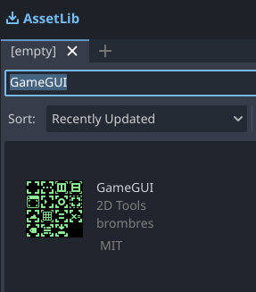

## Installing From GitHub Release

1. Download the latest [release](https://github.com/brombres/Godot-GameGUI/releases).

2. Drag the `addons` folder into a Godot project.

3. Enable the plug-in under Project > Project Settings... > Plug-ins.

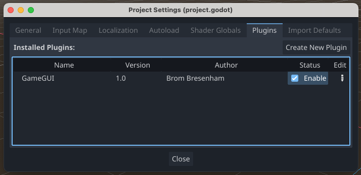

# Component Overview

## Core Layout Components

<table width=100%>
  <tr>
    <th>Icon</th>
    <th>Node</th>
    <th>Description</th>
  </tr>
  <tr>
    <td width=80px></td>
    <td>GGComponent</td>
    <td>GameGUI base node type. Useful as container, sizer, filler, spacer. Lays out children in a layered stack.</td>
  </tr>
  <tr>
    <td width=80px></td>
    <td>GGHBox</td>
    <td>Lays out children in a horizontal row.</td>
  </tr>
  <tr>
    <td width=80px></td>
    <td>GGVBox</td>
    <td>Lays out children in a vertical column.</td>
  </tr>
</table>

## Additional Layout Components

<table width=100%>
  <tr>
    <td width=80px>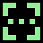</td>
    <td>GGFiller</td>
    <td>A GGComponent with an icon and default name that indicates its purpose is to fill up extra space.</td>
  </tr>
  <tr>
    <td width=80px>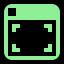</td>
    <td>GGInitialWindowSize</td>
    <td>If it is the root node of a scene, sets the window size to its own size on launch. Useful for testing independent UI component scenes at typical aspect ratios. If it is not the root scene node the window size is unaffected.</td>
  </tr>
  <tr>
    <td width=80px>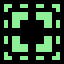</td>
    <td>GGLimitedSizeComponent</td>
    <td>Applies minimum and/or maximum sizes to its child content.</td>
  </tr>
  <tr>
    <td width=80px></td>
    <td>GGMarginLayout</td>
    <td>Adds inside margins to the layout of its child content.</td>
  </tr>
  <tr>
    <td width=80px></td>
    <td>GGOverlay</td>
    <td>Positions its child content arbitrarily within its layout area in a sprite-like manner.</td>
  </tr>
</table>

## Scaling Text Components

<table width=100%>
  <tr>
    <td width=80px></td>
    <td>GGButton</td>
    <td>A Button that can auto-scale its text size.</td>
  </tr>
  <tr>
    <td width=80px></td>
    <td>GGLabel</td>
    <td>A Label that can auto-scale its text size.</td>
  </tr>
  <tr>
    <td width=80px>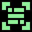</td>
    <td>GGRichTextLabel</td>
    <td>A RichTextLabel that can auto-scale its text size.</td>
  </tr>
</table>

## Image Components

<table width=100%>
  <tr>
    <td width=80px>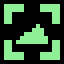</td>
    <td>GGTextureRect</td>
    <td>A TextureRect that uses the GameGUI layout system and automatically configures itself with appropriate defaults.</td>
  </tr>
  <tr>
    <td width=80px>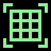</td>
    <td>GGNinePatchRect</td>
    <td>Replicates NinePatchRect functionality and makes the following improvement: when the bounds of a GGNinePatchRect are smaller than its corners, the corners are proportionally shrunk to fit the available bounds.</td>
  </tr>
</table>

## Parameter Components

<table width=100%>
  <tr>
    <td width=80px>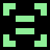</td>
    <td>GGLayoutConfig</td>
    <td>Place this near the root of the scene, extend the script, make it a @tool, override <code>func _on_begin_layout(display_size:Vector2)</code>, and call <code>set_parameter(name,value)</code> with various computed values related to the current display size. Those parameters can be automatically used by other GameGUI nodes by setting their sizing mode to <i>Parameter</i> and supplying the desired parameter name.</td>
  </tr>
  <tr>
    <td width=80px>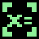</td>
    <td>GGParameterSetter</td>
    <td>Sets specified subtree parameters to its own width and/or height, which can then be used to set the size of other components when they're in <i>Parameter</i> sizing mode.</td>
  </tr>
</table>

# Scaling Modes

Each GameGUI component supports the following seven scaling modes. Horizontal and vertical scaling modes are set separately.

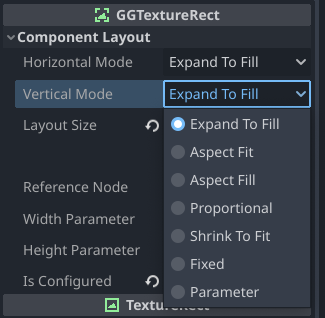

Mode | Description
-----|--------------
**Expand-to-Fill** | The component stretches or compresses to fill the available area.  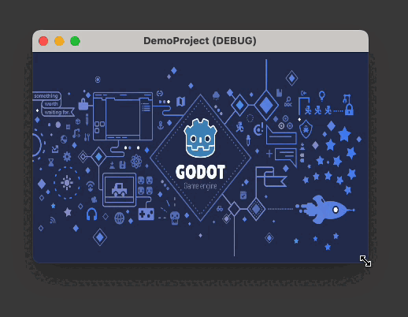
**Aspect-Fit** | The component maintains the specified aspect ratio and is sized as large as possible while still fitting in the available area.    The <b>Layout Size</b> property should be set to the desired aspect ratio. Note that 1680x840 has the same effect as 168x84, etc.  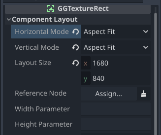
**Aspect-Fill** | The component maintains the specified aspect ratio and is sized as small as possible while still completely filling the available area.  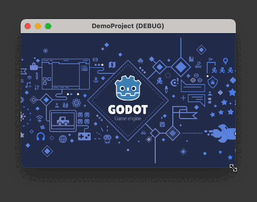  Note that Container Sizing options can be used to pin the content to a side or a corner.  
**Proportional** | Proportional mode can be used in one of two ways:  1. In the standard mode, the node size or other applicable property (such as GGMarginLayout margins) becomes a fraction of its available layout area, from 0.0 to 1.0. 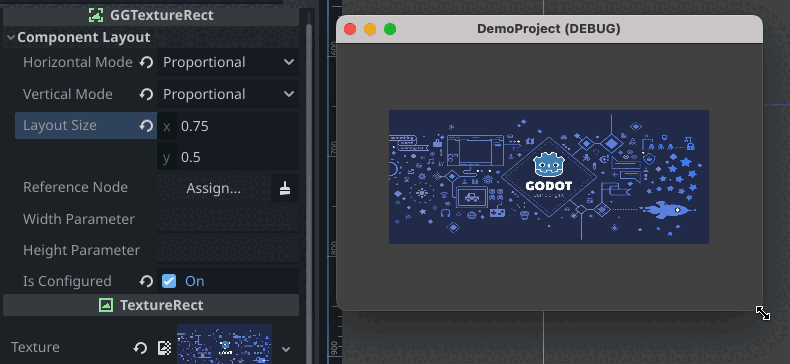  2. Alternatively, a component's `reference node` property can be set and the proportional value is now relative to the size of the reference node. The reference node should be in a higher subtree (closer to the root) than the node referencing it to ensure that the reference node size is established first. In the example below, a square-aspect component is used as the reference node for a GGMarginLayout so that the gap around the image has the same thickness on all sides. 
**Shrink-to-Fit** | The component is sized as small as possible to enclose all of its children. For example, here is a GGVBox with fixed-size children set to **Shrink-to-Fit**.  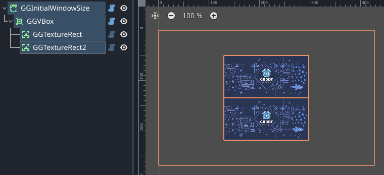
**Fixed** | The component uses **Layout Size** as a fixed pixel size.  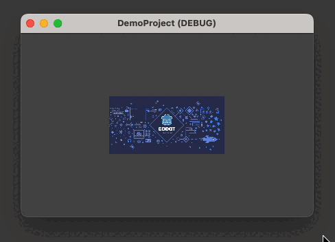
**Parameter** | The component sets its pixel size to the subtree parameters named by the properties **Width Parameter** and/or **Height Parameter**. Create a `GGLayoutConfig` config as the first child of a GameGUI subtree, extend its script, add the `@tool` annotation, and override `func _on_begin_layout(display_size:Vector2)` to update parameters (via `set_parameter(name:String,value:Variant)`, `get_parameter(name:String)->Variant`, and/or `has_parameter(name:String)->bool`) whenever the layout is about to be updated.    Parameter values can be added, inspected, and removed in the editor by examining the **Parameters** property of a GameGUI subtree root.  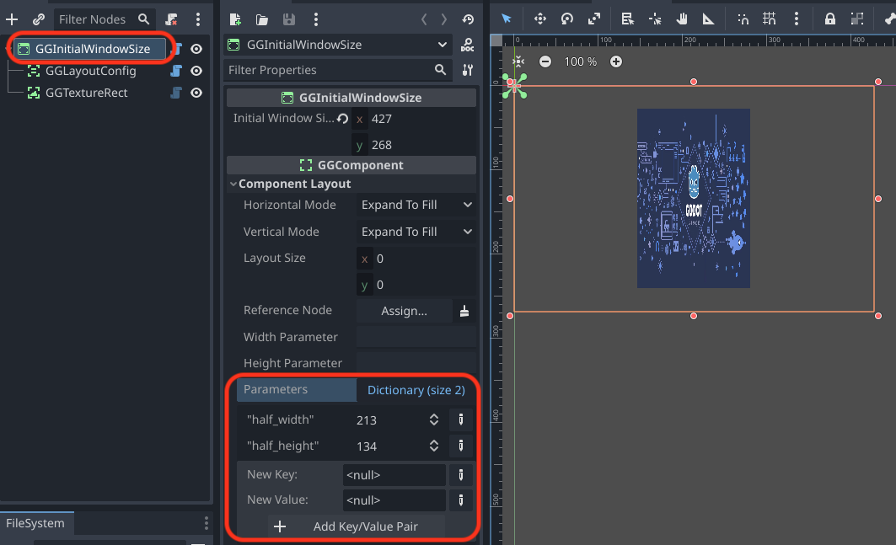

## Aspect Mode Combinations

Horizontal Mode | Vertical Mode | Effect
----------------|---------------|-------
Aspect-Fit      | Aspect-Fit    | Component maintains the specified aspect ratio and is sized as large as possible while still fitting in the available area.
Aspect-Fill     | Aspect-Fill   | Component maintains the specified aspect ratio and is sized as small as possible while still completely filling the available area.
Aspect-Fill     | Aspect-Fit    | Component occupies all available width while maintaining the specified aspect ratio.
Aspect-Fit      | Aspect-Fill   | Component occupies all available height while maintaining the specified aspect ratio.

## Built-In Parameters

GameGUI automatically sets and maintains a small set of built-in parameters.

Any component extending GGComponent can set its width and/or height to a parameter value by selecting the "Fixed" Horizontal and/or Vertical Mode and supplying the appropriate parameter name in the "Width Parameter" and/or "Height Parameter" field.

In scripts extending a GameGUI component these parameters can be retrieved with `get_parameter("parameter_name",default_value)`.

### Safe Area Margin Parameters

Each margin parameter contains the number of pixels at a given edge of the display that cannot be safely drawn to due to a notch or rounded corners. For example, on iPhone 12 Pro, `safe_area_top_margin` will be set to `132` and `safe_area_bottom_margin` will be set to `102`.

Parameter Name            | Description
--------------------------|--------------
`safe_area_left_margin`   | The left pixel margin outside the safe area.
`safe_area_top_margin`    | The top pixel margin outside the safe area.
`safe_area_right_margin`  | The right pixel margin outside the safe area.
`safe_area_bottom_margin` | The bottom pixel margin outside the safe area.

Here is a simple GameGUI setup to include safe area margins in an app. A GGVbox contains top and bottom GGFiller components, their heights set to `Parameter` `safe_area_top_margin` and `Parameter` `safe_area_bottom_margin`, respectively. These parameters will be zero during desktop testing in windowed mode and non-zero on any modern iPhone, for example.

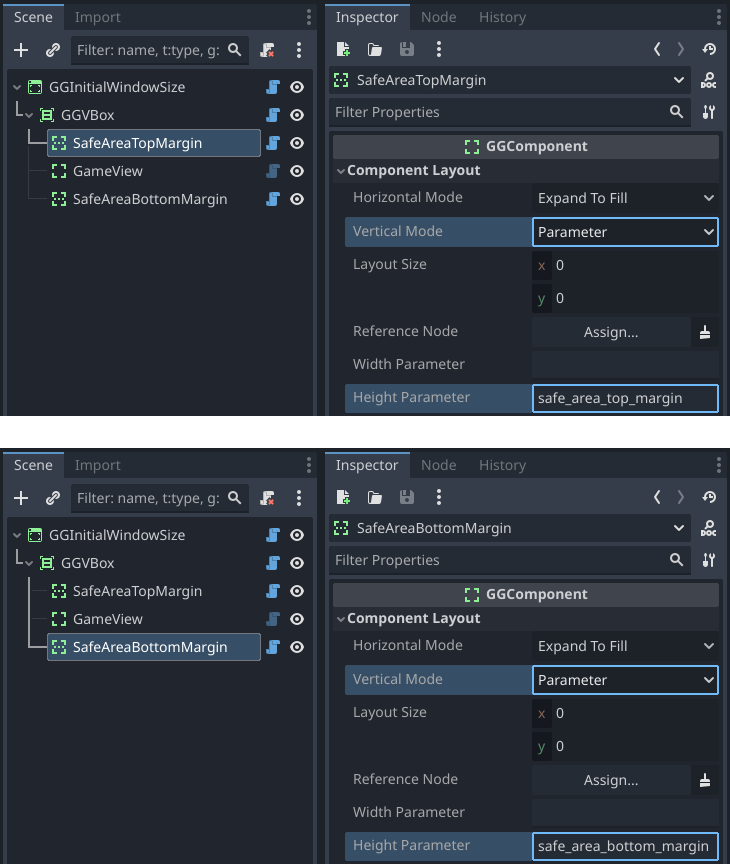

# Component Details

## Core Layout Components

### GGComponent

GameGUI base node type. Useful as container, sizer, filler, spacer. Lays out children in a layered stack.
A common use case is to create multiple UI layers in a root GGComponent (or GGInitialWindowSize, etc.).
The first child might be an aspect-fill GGTextureRect background image, the second child a GGHBox or
GGVBox for the main layout, and possibly finishing with a GGOverlay for a floating info panel or similar.

The following properties are available in all GameGUI nodes except for GGLayoutConfig.

#### Properties

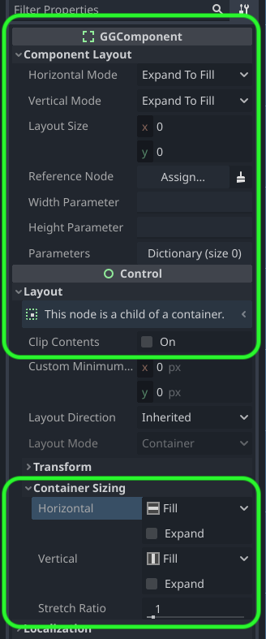

<table>
  <tr>
    <th>Property</th><th>Description</th>
  </tr>
  <tr>
    <th>Horizontal Mode</th>
    <td>Set to one of the <a href="#Scaling-Modes">Scaling Modes</a>.</td>
  </tr>
  <tr>
    <th>Vertical Mode</th>
    <td>Set to one of the <a href="#Scaling-Modes">Scaling Modes</a>. Can be set to a different mode than <b>Horizontal Mode</b>.</td>
  </tr>
  <tr>
    <th>Layout Size</th>
    <td>
      <ul>
        <li>Treated as an aspect ratio for scaling modes <b>Aspect-Fit</b> and <b>Aspect-Fill</b>.
        <li>Treated as a fractional value between 0.0 and 1.0 for scaling mode <b>Proportional</b>. Note that Godot allows
            values to be entered as e.g. <code>32.0/1024.0</code> for convenience.
        <li>Treated as a pixel value for scaling mode <b>Fixed</b>.
        <li>Treated as a default pixel value for scaling mode <b>Parameter</b>.
            For example, if <b>Width Parameter</b> is undefined, <code>x</code> will be used as a pixel width.
      </ul>
    </td>
  </tr>
  <tr>
    <th>Reference Node</th>
    <td>
      When a scaling mode is set to <b>Proportional</b>, by default the <b>Layout Size</b> is taken to be a fraction
      of the layout size available to this node - 1.0 for full size, 0.5 for half size, and so on. If <b>Reference Node</b>
      is set, <b>Layout Size</b> is a fraction of the reference node's size instead. The reference node should be
      in a higher subtree (closer to the root) than the node referencing it.
    </td>
  </tr>
  <tr>
    <th>Width Parameter</th>
    <td>
      When <b>Horizontal Mode</b> is set to <b>Parameter</b>, <b>Width Parameter</b> is the name of the subtree
      parameter to use as the pixel width for this node. If the name or the parameter is undefined, the <code>x</code>
      component of <b>Layout Size</b> is used as the pixel width.
    </td>
  </tr>
  <tr>
    <th>Height Parameter</th>
    <td>
      when <b>Vertical Mode</b> is set to <b>Parameter</b>, <b>Height Parameter</b> is the name of the subtree
      parameter to use as the pixel height for this node. If the name or the parameter is undefined, the <code>y</code>
      component of <b>Layout Size</b> is used as the pixel height.
    </td>
  </tr>
  <tr>
    <th>Parameters</th>
    <td>
      If this node is the root of a GameGUI subtree (meaning its parent does not extend <code>GGComponent</code>),
      any parameters defined using <code>set_parameter(name:String,value:Variant)</code> will be stored here.
      Parameters can be added, inspected, or modified in the Editor as well.
    </td>
  </tr>
  <tr>
    <th>Clip Contents</th>
    <td>
      This inherited property is useful for clipping the overflow of child components that are larger than their parent.
    </td>
  </tr>
  <tr>
    <th>Custom Minimum Size [IGNORED]</th>
    <td>
      This inherited property is <b>ignored</b> by GameGUI. Instead wrap components in a GGLimitedSizeComponent with more flexible
      minimum size options.
    </td>
  </tr>
  <tr>
    <th>Container Sizing: Horizontal and Vertical</th>
    <td>
      GGComponent respects the inherited <b>Horizontal and Vertical Container Sizing</b> properties for aligning child content that is smaller than the parent.
      Note that <b>Fill</b> is treated as <b>Center</b> and <b>Expand</b> is ignored.
    </td>
  </tr>
  <tr>
    <th>Container Sizing: Stretch Ratio</th>
    <td>
      GGComponent respects the inherited <b>Stretch Ratio</b> property for setting the proportional expansion weights
      of <b>Expand-to-Fill</b> components.
    </td>
  </tr>
</table>

### GGHBox

Lays out children in a horizontal row. Here is the general algorithm:

1. Fixed-width, aspect-width, and GGLimitedSizeComponent minimum-width children are given their fixed or minimum width, with aspect width being calculated using the height of the GGHBox.
2. Remaining width is distributed among remaining expand-to-fill-width children according to their stretch ratio weights.

### GGVBox

Lays out children in a vertical row. Here is the general algorithm:

1. Fixed-height, aspect-height, and GGLimitedSizeComponent minimum-height children are given their fixed or minimum height, with aspect height being calculated using the width of the GGVBox.
2. Remaining height is distributed among remaining expand-to-fill-height children according to their stretch ratio weights.

## Additional Layout Components

### GGFiller

A GGComponent with an icon and default name that indicates its purpose is to fill up extra space. There is no technical difference between a GGFiller and a GGComponent.

### GGInitialWindowSize

IF it is the root node of a scene, sets the window size to its own size on launch. Useful for testing independent UI component scenes at typical aspect ratios. If it is not the root scene node the window size is unaffected.

#### Properties

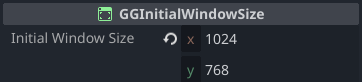

Property|Description
--------|-----------
**Initial Window Size** | Arbitrary pixel dimensions for the initial window size. This can be set by editing the numbers or by dragging the component's bounding box handles in the 2D view.

### GGLimitedSizeComponent

Applies minimum and/or maximum sizes to its child content.

#### Properties

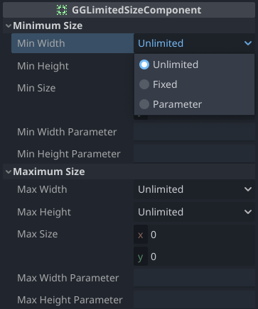

Property|Description
--------|-----------
**Min Width** | Selects the minimum width mode: Unlimited, Fixed, or Parameter.
**Min Height** | Selects the minimum height mode: Unlimited, Fixed, or Parameter.
**Min Size** | The minimum size pixel values in Fixed mode and the default pixel sizes in Parameter mode if the parameter is undefined.
**Min Width Parameter** | The name of a subtree parameter to use as the minimum pixel width.
**Min Height Parameter** | The name of a subtree parameter to use as the minimum pixel height.
**Max Width** | Selects the maximum width mode: Unlimited, Fixed, or Parameter.
**Max Height** | Selects the maximum height mode: Unlimited, Fixed, or Parameter.
**Max Size** | The maximum size pixel values in Fixed mode and the default pixel sizes in Parameter mode if the parameter is undefined.
**Max Width Parameter** | The name of a subtree parameter to use as the maximum pixel width.
**Max Height Parameter** | The name of a subtree parameter to use as the maximum pixel height.

### GGMarginLayout

Adds inside margins to the layout of its child content.

#### Properties

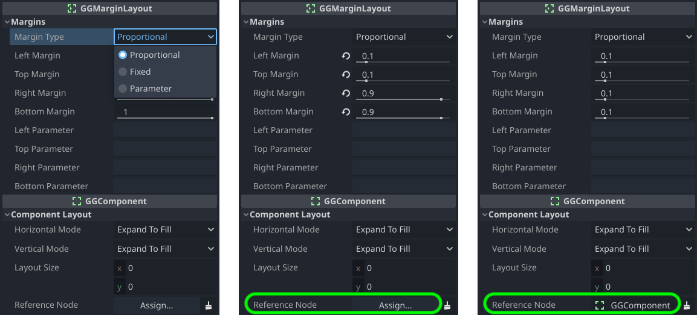

##### Margin Type: Proportional (No Reference Node)

Property|Description
--------|-----------
**Left Margin Top Margin** | The top and left margins as a proportion of the available area, `0.0`-`1.0`.
**Right Margin Bottom Margin** | The right and bottom margins as a proportion of the available area, `0.0`-`1.0`. Note that `1.0` means "no margin" and `0.9` means a 10% margin because it begins 90% of the way into the available area.

##### Margin Type: Proportional (With Reference Node)

Property|Description
--------|-----------
**Left Margin Top Margin** | The top and left margins as a proportion of the reference node size, `0.0`-`1.0`.
**Right Margin Bottom Margin** | The right and bottom margins as a proportion of the reference node size, 0.0-1.0. Note that `0.0` means "no margin" and `0.1` means a margin that is 10% of the size of the reference node.

##### Margin Type: Fixed
Property|Description
--------|-----------
**Left Margin Top Margin Right Margin Bottom Margin** | The pixel sizes of the four margins. `0` means "no margin".

##### Margin Type: Parameter
Property|Description
--------|-----------
**Left Parameter Top Parameter Right Parameter Bottom Parameter** | The names of subtree parameters that define the pixel sizes of the four margins. If Left Parameter is undefined then Left Margin is used as the pixel size, and so on.

### GGOverlay

Positions its child content arbitrarily within its layout area in a sprite-like manner.

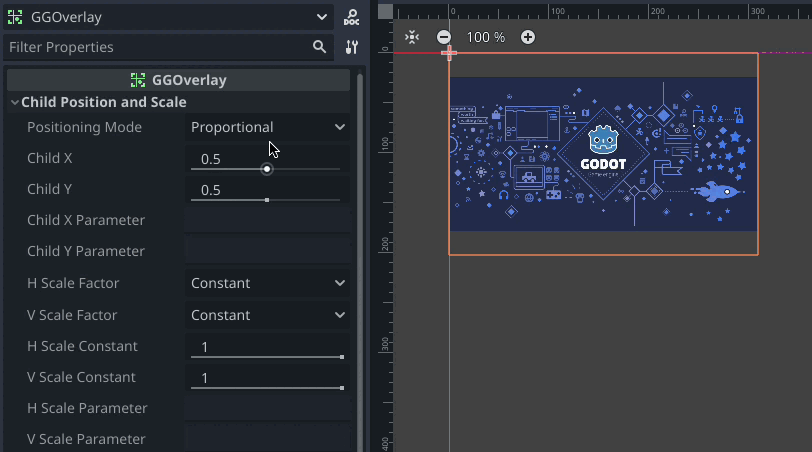

#### Properties

Property|Description
--------|-----------
**Positioning Mode** | Selects the Positioning Mode: Proportional, Fixed, or Parameter.
**Child X** | The horizontal child offset: `0.0`-`1.0` in Proportional mode, a pixel offset in Fixed mode, and a default pixel offset for an undefined parameter in Parameter mode.
**Child Y** | The vertical child offset: `0.0`-`1.0` in Proportional mode, a pixel offset in Fixed mode, and a default pixel offset for an undefined parameter in Parameter mode.
**Child X Parameter** | The name of the subtree parameter for the horizontal child offset in Parameter mode.
**Child Y Parameter** | The name of the subtree parameter for the vertical child offset in Parameter mode.
**H Scale Factor** | Selects the horizontal child layout area scaling mode: Constant or Parameter.
**V Scale Factor** | Selects the vertical child layout area scaling mode: Constant or Parameter.
**H Scale Constant** | The horizontal child layout area scaling factor in Constant mode and the default scaling factor for an undefined parameter in Parameter mode.
**V Scale Constant** | The vertical child layout area scaling factor in Constant mode and the default scaling factor for an undefined parameter in Parameter mode.
**H Scale Parameter** | The name of the subtree parameter for the horizontal child layout area scaling factor.
**V Scale Parameter** | The name of the subtree parameter for the vertical child layout area scaling factor.

## Scaling Text Components

### GGButton

A Button that can auto-scale its text size.

#### Text Size Modes

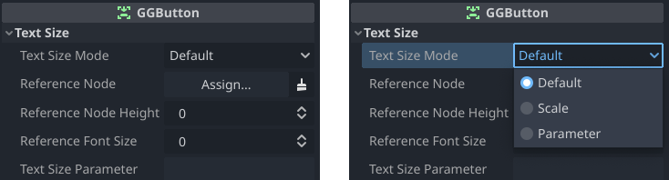

Mode|Description
--------|-----------
**Default** | The size of the button text is fixed and is set via standard Button control properties. Extended GGButton properties have no effect.
**Scale** | Set the button text size as desired for the current layout, assign a size Reference Node (which can be the GGButton itself), and then switch Text Size Mode to Scale. The GGButton's text size will then automatically scale with the size of the reference node.
**Parameter** | The size of the button text is determined by the subtree parameter named by the Text Size Parameter property.

### GGLabel

A Label that can auto-scale its text size.

#### Text Size Modes

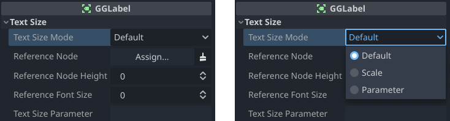

Mode|Description
--------|-----------
**Default** | The size of the label text is fixed and is set via standard Label control properties. Extended GGLabel properties have no effect.
**Scale** | Set the label text size as desired for the current layout, assign a size Reference Node (typically the GGLabel's parent, as the GGLabel's size is dependent on the text size), and then switch Text Size Mode to Scale. The GGLabel's text size will then automatically scale with the size of the reference node.
**Parameter** | The size of the label text is determined by the subtree parameter named by the Text Size Parameter property.

### GGRichTextLabel

A RichTextLabel that can auto-scale its text size.

#### Text Size Modes

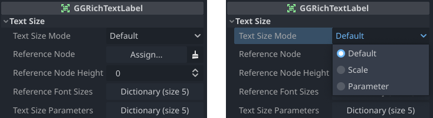

Mode|Description
--------|-----------
**Default** | The size of the label text is fixed and is set via standard Label control properties. Extended GGRichTextLabel properties have no effect.
**Scale** | Set the label text size as desired for the current layout, assign a size Reference Node (typically the GGRichTextLabel's parent, as the GGRichTextLabel's size is dependent on the text size), and then switch Text Size Mode to Scale. The GGRichTextLabel's text size will then automatically scale with the size of the reference node.
**Parameter** | The size of the label text is determined by the subtree parameter named by the Text Size Parameter property.

## Image Components

### GGTextureRect

GGTextureRect is a TextureRect that supports GameGUI scaling modes and auto-configures appropriate properties.

Once a texture is assigned to the Texture property, the GGTextureRect auto-configures itself by setting the following properties:

- Horizontal and Vertical Scaling Modes are set to Aspect Fit.
- Layout Size is set to the original pixel dimensions of the texture.
- Expand Mode is set to Ignore Size.
- Is Configured is set to `true`.

If the configuration above becomes modified and you wish to restore the original configuration, uncheck Is Configured and the GGTextureRect will be reconfigured.

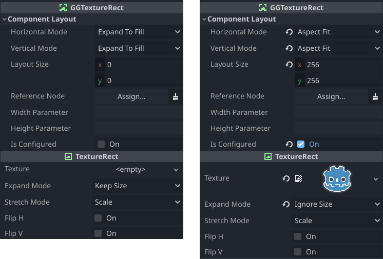

For most purposes the images that provide the textures for GGTextureRect nodes should be imported with mipmaps enabled and the texture filter mode should be set to Linear Mipmap so that images look good when scaled down. To import with mipmaps, select one or more images in the FileSystem panel, switch from the Scene tab to the Import tab, tick the `Mipmaps > Generate` checkbox, and click `Reimport(*)`.

To enable Linear Mipmap mode, inspect the properties of the scene's root node (or the CanvasItem parent node that's closest to the scene root) and change `Texture > Filter` to `Linear Mipmap`. As nodes use mode `Inherited` by default, all other nodes will now use Linear Mipmap mode.

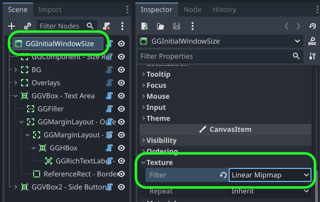

### GGNinePatchRect

GGNinePatchRect replicates NinePatchRect functionality and makes the following improvement: when the bounds of a GGNinePatchRect are smaller than its corners, the corners are proportionally shrunk to fit the available bounds.

(The 9-patch image is from [pixy.org](https://pixy.org/474956/))

#### Properties

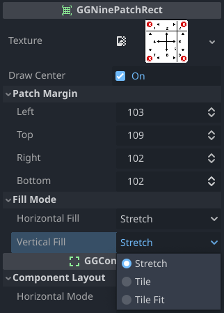

Property|Description
--------|-----------
**Texture** | The texture to use for the nine-patch rect.
**Draw Center** | Check to draw the center patch of the nine-patch rect (default); uncheck to omit the center patch.
**Patch Margin: Left** | The pixel width of the left side of the texture that comprises three patches: top-left, left, and bottom-left.
**Patch Margin: Top** | The pixel height of the top side of the texture that comprises three patches: top-left, top, and top-right.
**Patch Margin: Right** | The pixel width of the right side of the texture that comprises three patches: top-right, right, and bottom-right.
**Patch Margin: Bottom** | The pixel height of the bottom side of the texture that comprises three patches: bottom-left, bottom, and bottom-right.
**Fill Mode: Horizontal** | The horizontal fill mode for each patch.
**Fill Mode: Vertical**   | Ther vertical fill mode for each patch.

Fill Mode | Description
----------|------------
Stretch   | Stretch or compress each patch to cover the available space.
Tile      | Repeatedly tile each patch at its original pixel size to cover the available space.
Tile Fit  | Tile each patch, stretching slightly as necessary to ensure a whole number of tiles fit in the available space.

## Parameter Components

### GGLayoutConfig

Place this node near the root of the GameGUI scene or subtree, extend the script, make it a `@tool`, override `func _on_begin_layout(display_size:Vector2)`, and call inherited method `set_parameter(name,value)` with various computed values related to the current display size. Those parameters can be automatically used by other GameGUI nodes by setting their sizing mode to *Parameter* and supplying the desired parameter name.

All GameGUI components define the following methods. A "subtree root" is the highest-level ancestor in an unbroken line of GameGUI component ancestors from the component that one of these methods is called on.

Method | Description
-------|------------------
`has_parameter(name:String)->bool` | Returns true if the subtree root's `parameters` dictionary defines a value with the specified name.
`set_parameter(name:String,value:Variant)` | Sets a value in the subtree root's `parameters` dictionary.
`get_parameter(name:String,default_result:Variant=0)->Variant` | Returns the specified value from the subtree root's `parameters` dictionary, if it exists, or else returns `default_result` if the value doesn't exist.

### GGParameterSetter

After a GGParameterSetter has been sized according to its settings, it sets specified subtree parameters to its own width and/or height, which can then be used to set the size of other components when they're in *Parameter* sizing mode.

#### Properties

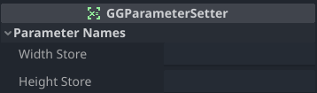

Property|Description
--------|-----------
**Width Store** | The name of the subtree parameter to store this node's width in.
**Height Store** | The name of the subtree parameter to store this node's height in.

